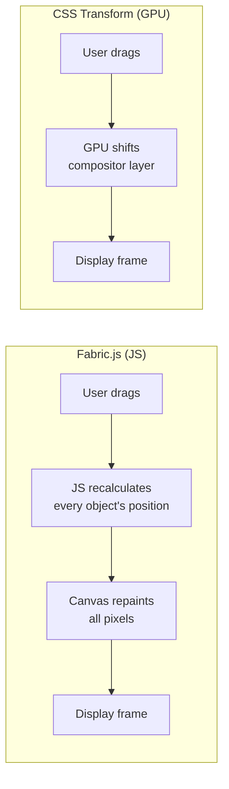
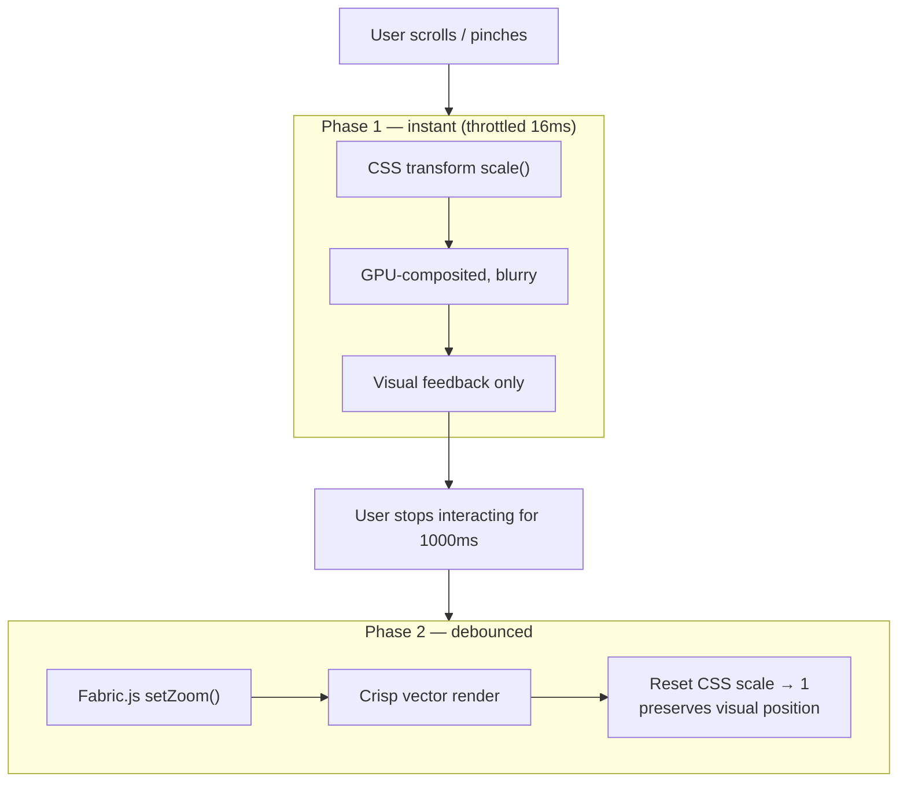
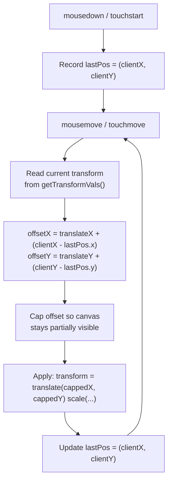
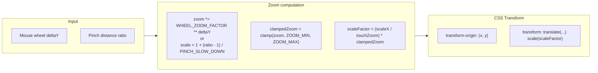
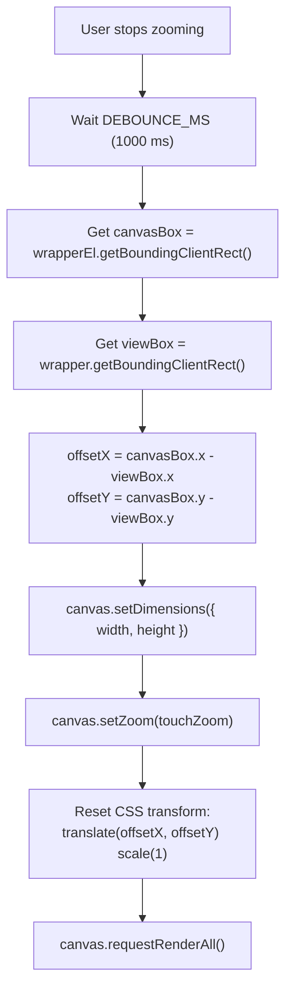
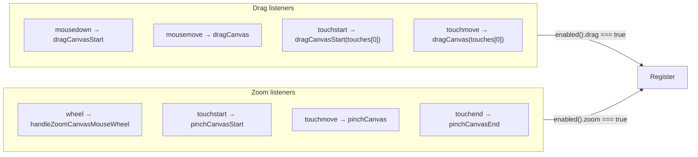

# Canvas Drag & Zoom — `useCanvasDragAndZoom`

> **Document type:** Explanation  
> **Audience:** Developers working on the drawing board feature  
> **Goal:** Understand how CSS transform-based drag and zoom works, why it is performant, and how the hook orchestrates it

---

## 1. Overview

The hook provides smooth, performant canvas navigation for a Fabric.js drawing board. It handles three interaction modes:

| Mode           | Input                           | Mechanism                        |
| -------------- | ------------------------------- | -------------------------------- |
| **Drag (pan)** | Mouse drag, single-finger touch | CSS `translate`                  |
| **Zoom**       | Mouse wheel                     | CSS `scale` + exponential factor |
| **Pinch zoom** | Two-finger touch                | CSS `scale` + Euclidean distance |

All three share a common foundation: **CSS `transform`** applied to the canvas wrapper element. This keeps interactions at 60 fps because transforms are GPU-composited and don't trigger layout or paint.

---

## 2. The Core Idea: CSS Transform as a GPU Layer

### Why CSS `transform` is faster

When you change an element's `transform` via CSS, the browser **promotes that element to its own compositor layer** on the GPU. Moving or scaling that layer does **not** trigger a repaint of the element's content — the GPU simply shifts or stretches the existing pixels.



The JS approach touches every object on the canvas — for hundreds of objects this means hundreds of matrix multiplications and repaints per frame. The CSS approach touches exactly one element's style and lets the GPU do the rest.

### The trade-off

The entire canvas content must be **drawn in full at all times**, because CSS `transform` only shifts the rendered layer — it does not change what Fabric.js has drawn. Content outside the visible area is still rendered but clipped by the wrapper's `overflow: hidden`.

---

## 3. Architecture: The Two-Phase Zoom Strategy

Zooming has a fundamental tension:

- **CSS `transform: scale()`** is cheap and smooth but produces a blurry canvas (the browser scales rasterized pixels).
- **Fabric.js `canvas.setZoom()`** re-renders vector objects at the target resolution (crisp) but is expensive — it recalculates every object's position, dimensions, and stroke widths.

The hook resolves this with a **two-phase strategy**:



**Phase 1** (`throttledScaleCanvas`) runs during active interaction. It applies `scale()` to the wrapper's CSS transform, giving instant visual feedback at 60 fps.

**Phase 2** (`canvasScaleToZoom`) fires 1000 ms after the user stops interacting. It reads the final bounding box of the scaled wrapper, calls `canvas.setZoom(touchZoom)`, and resets the CSS transform to `scale(1)` — preserving the visual position so the user sees no jump.

---

## 4. The CSS Transform Matrix

Every CSS `transform` applied to the wrapper is stored by the browser as a **2D affine transformation matrix**:

```
⎡ m11  m21  m31  m41 ⎤      ⎡ scaleX  0       0   translateX ⎤
⎢ m12  m22  m32  m42 ⎥  =   ⎢ 0       scaleY  0   translateY ⎥
⎢ m13  m23  m33  m43 ⎥      ⎢ 0       0       1   0          ⎥
⎣ m14  m24  m34  m44 ⎦      ⎣ 0       0       0   1          ⎦
```

The hook reads the current transform state via `getTransformVals`:

```ts
// src/features/drawing-board/utils.ts
export function getTransformVals(el: HTMLElement) {
  const style = window.getComputedStyle(el);
  const matrix = new DOMMatrixReadOnly(style.transform);
  return {
    scaleX: matrix.m11, // horizontal scale
    scaleY: matrix.m22, // vertical scale
    translateX: matrix.m41, // horizontal translation (px)
    translateY: matrix.m42, // vertical translation (px)
    width: el.getBoundingClientRect().width,
    height: el.getBoundingClientRect().height,
  };
}
```

| Matrix cell | CSS property | Meaning                 |
| ----------- | ------------ | ----------------------- |
| `m11`       | `scaleX`     | Horizontal scale factor |
| `m22`       | `scaleY`     | Vertical scale factor   |
| `m41`       | `translateX` | Horizontal offset in px |
| `m42`       | `translateY` | Vertical offset in px   |

When the hook writes a transform like `translate(100px, 50px) scale(2)`, the browser composes these into a single matrix. Reading it back via `DOMMatrixReadOnly` gives the accumulated values — even if multiple transforms were applied over time.

---

## 5. Drag: Translating the Canvas

### Delta accumulation

Dragging works by accumulating mouse movement deltas:

```
newTranslateX = currentTranslateX + (event.clientX - lastPos.x)
newTranslateY = currentTranslateY + (event.clientY - lastPos.y)
```

Each frame, the difference between the current pointer position and the _previous frame's_ pointer position is added to the existing translation. This is a classic **delta-based pan** — simple and frame-rate-independent.

```ts
const offsetX = tVals.translateX + (event.clientX - lastPos.x);
const offsetY = tVals.translateY + (event.clientY - lastPos.y);
lastPos.x = event.clientX;
lastPos.y = event.clientY;
```



### Coordinate capping

Without limits, the user could drag the canvas entirely out of view. The `capCanvasOffset` function constrains the translation so the canvas never drifts more than **50 % of the wrapper's dimension** past center.

```ts
const capCanvasOffset = (
  offset: number,
  containerDimension: number,
  wrapperDimension: number,
) => {
  const maxOffset = wrapperDimension * CAP_OFFSET_RATIO; // 0.5
  const centerOffset = (wrapperDimension - containerDimension) / 2;
  const minOffset = centerOffset - maxOffset;
  const maxOffsetFinal = centerOffset + maxOffset;
  const capped = Math.max(offset, minOffset);
  return Math.min(capped, maxOffsetFinal);
};
```

**Visual:**

```
┌──────────────────────┐  ← wrapper (viewport)
│                      │
│   ┌──────────────┐   │
│   │              │   │  ← canvas container
│   │   (content)  │   │
│   │              │   │
│   └──────────────┘   │
│                      │
└──────────────────────┘

centerOffset = (wrapperWidth - containerWidth) / 2
              ↑ position where canvas is centered

Allowed range: [centerOffset - 0.5*wrapper, centerOffset + 0.5*wrapper]
               ↑ left limit                  ↑ right limit

If the canvas is smaller than the wrapper, centerOffset is negative
(the canvas starts left of the wrapper origin). The cap still allows
50% of the wrapper's width of travel in either direction.
```

This means the user can pull the canvas halfway off-screen in any direction, but no further — the canvas always remains reachable.

### Throttling

Mouse and touch events fire at high frequency (often > 100 Hz). We throttle `translateCanvas` to **16 ms** (~60 fps) — the fastest the display can refresh — avoiding wasted work.

```ts
const FRAME_16_MS = 16;
const throttledTranslateCanvas = throttle(translateCanvas, FRAME_16_MS);
```

---

## 6. Mouse-Wheel Zoom: Exponential Scaling

### The formula

```ts
const WHEEL_ZOOM_FACTOR = 0.999;
zoomLevel *= WHEEL_ZOOM_FACTOR ** deltaY;
```

`deltaY` is the mouse wheel delta (typically ±120 per notch on most mice, smaller on trackpads).

**Why exponential?** Perceptual uniformity. A scroll tick should feel like a constant zoom step regardless of the current zoom level. Exponential scaling achieves this:

```
At zoom 1.0:  1.0 × 0.999^120  ≈ 0.887  (≈ 11% change)
At zoom 2.0:  2.0 × 0.999^120  ≈ 1.774  (≈ 11% change)
```

The _relative_ change is constant. Linear scaling would feel sluggish at low zoom and hypersensitive at high zoom.

**Visual:**

```
zoomLevel
    │
 3.0 │                    ╱
    │                  ╱
 2.0 │               ╱
    │            ╱
 1.0 │        ╱
    │     ╱
 0.5 │  ╱
    │
    └──────────────────────────
              scroll distance

The curve is exponential: each unit of scroll distance multiplies
zoom by a constant factor, so the curve steepens as zoom increases.
```

### Zooming toward the cursor

The hook sets `transformOrigin` to the cursor's offset position before scaling:

```ts
c.wrapperEl.style.transformOrigin = `${aroundPoint.x}px ${aroundPoint.y}px`;
```

This makes the point under the cursor stay fixed — the canvas zooms _into_ the cursor rather than the center of the viewport. This is the expected behavior in tools like Figma, Photoshop, and map applications.

### Clamping

The zoom level is clamped to `[ZOOM_MIN, ZOOM_MAX]` = `[0.5, 3.0]`:

```ts
const clampedZoom = Math.min(Math.max(level, ZOOM_MIN), ZOOM_MAX);
```

---

## 7. Pinch Zoom: Touch Geometry

Pinch zoom uses two fingers. The math has three parts: distance, center, and slow-down.

### Euclidean distance

The distance between two touch points is the standard Euclidean distance:

```
distance = √((x₂ − x₁)² + (y₂ − y₁)²)
```

```ts
const getPinchDistance = (touch1: Touch, touch2: Touch) => {
  const coord = getPinchCoordinates(touch1, touch2);
  return Math.sqrt(
    Math.pow(coord.x2 - coord.x1, 2) + Math.pow(coord.y2 - coord.y1, 2),
  );
};
```

**Visual:**

```
  (x₁, y₁)  ●────────────●  (x₂, y₂)
              \          /
               \        /
                \      /
                 \    /
                  \  /
                   \/
                    √((x₂−x₁)² + (y₂−y₁)²)

The distance forms the hypotenuse of a right triangle whose legs
are the horizontal and vertical gaps between the two fingers.
```

### Pinch center

The zoom center is the midpoint between the two fingers, adjusted for the current translation:

```ts
pinchCenter = {
  x: (x₁ + x₂) / 2 - translateX,
  y: (y₁ + y₂) / 2 - translateY,
};
```

Subtracting `translateX`/`translateY` converts from screen coordinates to canvas-content coordinates. Without this adjustment, the zoom center would drift as the canvas is panned.

### Slow-down factor

```ts
const PINCH_SLOW_DOWN = 20;
let scale = Number((currentDistance / initialDistance).toFixed(2));
scale = 1 + (scale - 1) / PINCH_SLOW_DOWN;
```

Raw pinch ratios are mapped through a slow-down:

```
If fingers spread to 1.4× the initial distance:
  raw scale = 1.4
  effective = 1 + (1.4 - 1) / 20 = 1.02

If fingers pinch to 0.6× the initial distance:
  raw scale = 0.6
  effective = 1 + (0.6 - 1) / 20 = 0.98
```

This prevents the zoom from changing too aggressively on touch screens, where small finger movements would otherwise produce large zoom jumps. The factor of 20 was chosen empirically to feel natural.

### The scale-to-zoom conversion

CSS `scale()` and Fabric.js zoom are **independent** values. The hook maintains `touchZoom` — the "true" zoom level that Fabric.js knows about. The CSS `scale` is computed relative to it:

```
scaleFactor = (currentScaleX / touchZoom) * newZoom
```

This ensures that if Fabric.js already has a zoom of `2×` and the user pinches to `1.5×` of the current view, the CSS scale becomes `(1 / 2) * 1.5 = 0.75`, and `touchZoom` is updated to `1.5`.



---

## 8. The Blur Problem: Migrating CSS Scale to Fabric.js Zoom

### Why it gets blurry

CSS `scale()` is a **raster operation** — it stretches the existing pixel buffer. When you zoom in past 100 %, the GPU interpolates pixels, causing blur.

### The solution: `canvasScaleToZoom`

After the user stops zooming (debounced at 1000 ms), we **migrate** the CSS transform into Fabric.js's own zoom system:



```ts
const canvasScaleToZoom = debounce(() => {
  const wrapper = wrapperRef();
  if (!wrapper) return;

  const canvasBox = c.wrapperEl.getBoundingClientRect();
  const viewBox = wrapper.getBoundingClientRect();

  // preserve the visual position
  const offsetX = canvasBox.x - viewBox.x;
  const offsetY = canvasBox.y - viewBox.y;

  c.setDimensions({
    height: canvasBox.height,
    width: canvasBox.width,
  });
  c.setZoom(touchZoom);

  c.wrapperEl.style.transformOrigin = `0px 0px`;
  c.wrapperEl.style.transform = `translate(${offsetX}px, ${offsetY}px) scale(1)`;

  c.requestRenderAll();
}, DEBOUNCE_MS);
```

After migration, Fabric.js redraws all objects at the correct resolution — the image becomes sharp again.

---

## 9. Programmatic Zoom

The hook exposes `setZoom(level)` which allows external controls (e.g., zoom buttons) to set the zoom level. The `onSetZoom` effect detects changes to the `zoom` signal and computes the zoom center as the **center of the visible viewport**:

```ts
const point: Point = {
  x: viewBox.width / 2 - tVals.translateX,
  y: viewBox.height / 2 - tVals.translateY,
};
```

This ensures that programmatic zoom always centers on the middle of what the user sees.

---

## 10. Event Registration

Listeners are registered inside SolidJS `createEffect` blocks, making them reactive to the `enabled` signal:



Each effect creates an `AbortController` and cleans up on disposal, so toggling `enabled` cleanly adds/removes listeners.

---

## 11. Performance: Throttling & Debouncing

### Throttle at 16 ms (~60 fps)

```ts
const FRAME_16_MS = 16;
const throttledTranslateCanvas = throttle(translateCanvas, FRAME_16_MS);
const throttledScaleCanvas = throttle(scaleCanvas, FRAME_16_MS);
```

Both drag and zoom updates are throttled to **one execution per 16 ms** — matching the browser's typical vsync interval (1000 ms / 60 ≈ 16.67 ms). This ensures:

- No wasted work on frames the user never sees.
- The handler never queues more than one update per animation frame.
- Smooth 60 fps visual feedback.

### Debounce at 1000 ms

```ts
const DEBOUNCE_MS = 1000;
const canvasScaleToZoom = debounce(() => {
  /* Fabric.js setZoom */
}, DEBOUNCE_MS);
```

The expensive Fabric.js re-render (Phase 2) is debounced: it only fires **1000 ms after the user stops interacting**. This prevents:

- Re-rendering on every scroll tick during rapid zooming.
- Layout thrashing from repeated `getBoundingClientRect()` calls.
- Object flickering as Fabric.js recalculates positions mid-gesture.

### Cleanup

The debounced callback is cleared on unmount to prevent stale updates:

```ts
onCleanup(() => {
  canvasScaleToZoom.clear();
});
```

---

## 12. API Reference

### `useCanvasDragAndZoom`

```ts
function useCanvasDragAndZoom(
  canvas: Accessor<Canvas | undefined>,
  wrapperRef: Accessor<HTMLElement | undefined>,
  dragAndZoomSettings?: DragAndZoomSettings,
): CanvasDragAndZoomControls;
```

| Parameter             | Type                                 | Description                                                           |
| --------------------- | ------------------------------------ | --------------------------------------------------------------------- |
| `canvas`              | `Accessor<Canvas \| undefined>`      | Reactive Fabric.js canvas instance                                    |
| `wrapperRef`          | `Accessor<HTMLElement \| undefined>` | Reactive reference to the wrapper element that constrains drag bounds |
| `dragAndZoomSettings` | `DragAndZoomSettings` (optional)     | Initial settings, currently only `{ zoom: number }`                   |

### Return: `CanvasDragAndZoomControls`

```ts
interface CanvasDragAndZoomControls {
  enabled: Accessor<DragAndZoomEnabledSettings>;
  setEnabled: (v: DragAndZoomEnabledSettings) => void;
  zoom: Accessor<number>;
  setZoom: (level: number) => void;
}
```

| Property     | Type                                         | Description                                                                                    |
| ------------ | -------------------------------------------- | ---------------------------------------------------------------------------------------------- |
| `enabled`    | `Accessor<{ drag: boolean, zoom: boolean }>` | Reactive signal — individually toggles drag and zoom                                           |
| `setEnabled` | `(v) => void`                                | Update which interactions are active                                                           |
| `zoom`       | `Accessor<number>`                           | Current zoom level (clamped to `[0.5, 3.0]`)                                                   |
| `setZoom`    | `(level) => void`                            | Programmatically set zoom level. Triggers the same two-phase flow (CSS scale → Fabric.js zoom) |

### Constants

| Constant            | Value   | Description                                            |
| ------------------- | ------- | ------------------------------------------------------ |
| `DEFAULT_ZOOM`      | `1`     | Default zoom level (100 %)                             |
| `ZOOM_MIN`          | `0.5`   | Minimum zoom (50 %)                                    |
| `ZOOM_MAX`          | `3`     | Maximum zoom (300 %)                                   |
| `WHEEL_ZOOM_FACTOR` | `0.999` | Exponential base for mouse-wheel zoom                  |
| `PINCH_SLOW_DOWN`   | `20`    | Divisor that attenuates pinch-zoom sensitivity         |
| `CAP_OFFSET_RATIO`  | `0.5`   | Maximum drag offset as a fraction of wrapper dimension |
| `FRAME_16_MS`       | `16`    | Throttle interval (~60 fps)                            |
| `DEBOUNCE_MS`       | `1000`  | Debounce interval before committing Fabric.js zoom     |

---

## 13. Summary

The hook's design follows a clear set of principles:

1. **CSS transforms first** — all interactions manipulate `transform: translate() scale()` for GPU-composited 60 fps feedback.
2. **Fabric.js zoom second** — after the user pauses, the visual state is committed to Fabric.js's internal coordinate system for crisp rendering.
3. **Exponential zoom** — `WHEEL_ZOOM_FACTOR ** deltaY` provides perceptually uniform mouse-wheel zoom.
4. **Euclidean pinch geometry** — standard distance and midpoint math, with a slow-down factor for touch ergonomics.
5. **Coordinate capping** — drag is bounded to 50 % of the viewport past center, preventing the canvas from disappearing.
6. **Throttle + debounce** — cheap CSS updates run at frame rate; expensive re-renders wait for quiescence.
